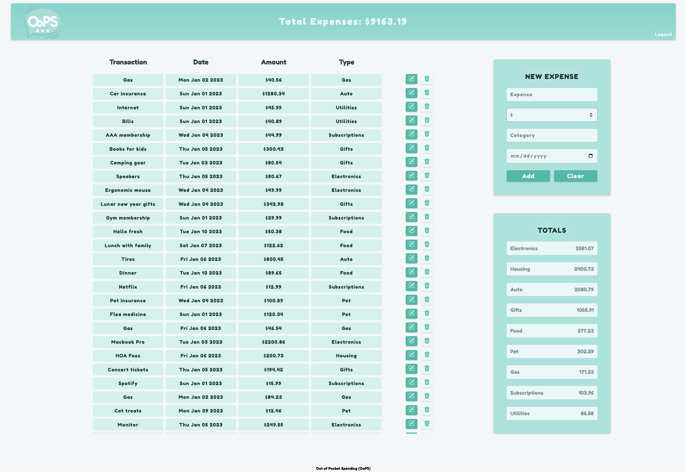
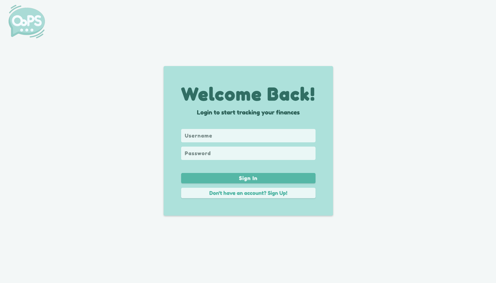
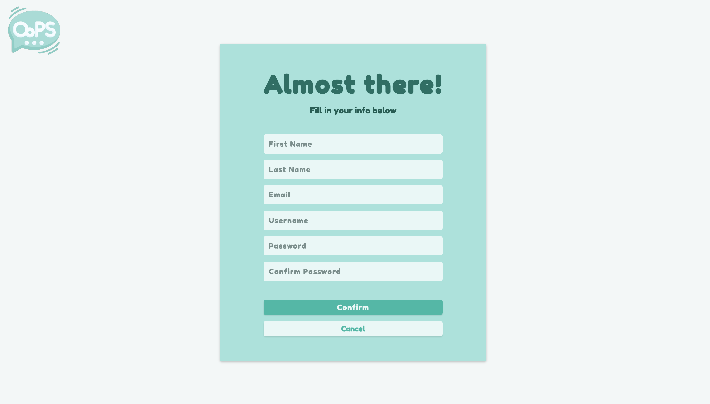

# Out of Pocket Spending (OoPS)

OoPS is a Personal Finance and Expense Tracking Application.

**_Note: This application only works with PG_URI value set in `.env` file. ReinForce is built to interact with any empty postgreSQL database._**

## Installation

Clone the repo to your local machine. Afterwards, install necessary packages.

```bash
npm install
```

## Usage

In the terminal for OoPS, use npm run start and npm run dev in separate terminals. Then navigate to http://localhost:5000 in your browser to use application.

```bash
npm run start
npm run dev
```

<div align="center">
    
    
    
</div>

## Contributing

Pull requests are welcome. For major changes, please open an issue first to discuss what you would like to change.

Please make sure to update tests as appropriate.
